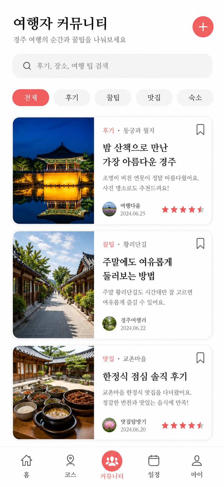
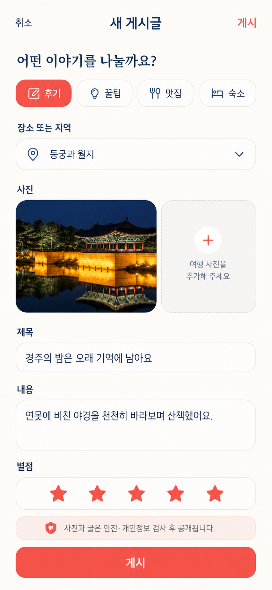
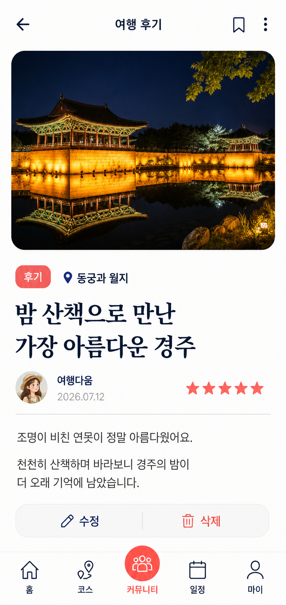

# 커뮤니티 UI/UX 셋업 초안

경주 관광 앱의 FE-B 담당 커뮤니티 화면 설계 자료다. 작업 시작 기준 커밋 `e13734f8d7c31d0fc30d4a0daba320060f3b86ad`의 초기 커뮤니티 구현을 바탕으로 요구사항 정의서의 `FR-COM-001~004`와 Sprint 4 범위를 화면 단위로 구체화한다.

이 자료와 관련 FE 코드는 현재 로컬 Git working tree에만 있으며 아직 커밋·푸시되지 않았다. 따라서 원격 GitHub의 커밋 이력에는 반영되지 않았다.

## 범위

- 여행 후기 작성·조회와 사진 첨부
- 지역·카테고리별 꿀팁 탐색
- 맛집·숙소 별점과 텍스트 리뷰
- 개인 북마크
- 목록·작성·상세 화면
- 한국어·영어·일본어·중국어 UI 확장 구조
- 모바일 우선 반응형과 접근성 상태

댓글, 좋아요, 팔로우, 알림, 관리자 화면은 현재 요구사항에 없으므로 이번 셋업에서 제외한다.

## 화면 자료

| 파일 | 목적 |
|---|---|
| `images/community-list-concept.png` | 피드, 검색·필터, 게시글 카드, 북마크 콘셉트 |
| `images/community-write-concept.png` | 카테고리·장소·사진·별점·본문 작성 콘셉트 |
| `images/community-detail-concept.png` | 게시글 상세, 사진, 장소·평점, 북마크, 작성자 메뉴 콘셉트 |

### 미리보기

#### 목록

#### 작성

#### 상세

> 위 PNG 3장은 AI로 생성한 기능·정보 구조 검토용 콘셉트다. 실제 실행 화면 캡처, Figma export 또는 최종 승인 디자인 원본이 아니다. 정확한 문구와 상태 규칙은 `screen-spec.md`를 정본으로 사용한다.

## 디자인 방향

기존 스탬프·AI 코스·일정·장바구니 시안과 같은 제품군으로 보이도록 다음 규칙을 사용한다.

- 기준 뷰포트: 모바일 390px, 앱 셸 최대 폭 430px
- 배경: 흰색 또는 따뜻한 미색
- 주요 색상: 코랄 레드 `#F45F62`
- 보조 색상: 딥 네이비 `#173E78`
- 카드: 옅은 회색 배경, 20~24px 둥근 모서리
- 필터: 가로 스크롤 가능한 pill chip
- 이미지: 관광지 사진 중심, 카드 상단 또는 좌측 배치
- 하단 내비게이션: 홈·코스·중앙 액션·일정·마이 구조 유지
- 텍스트 대신 아이콘만 쓰는 버튼에는 접근 가능한 이름 제공
- 최소 터치 영역: 44×44px

## 정보 구조

### 목록

1. 상단 제목과 글쓰기 버튼
2. 검색 입력
3. 지역·카테고리 필터
4. 최신순 피드
5. 카드별 사진, 카테고리, 장소, 작성자, 날짜, 제목, 요약, 별점, 북마크
6. 로딩·빈 결과·오류·더 보기 상태

### 작성

1. 작성 취소와 제목
2. 후기·꿀팁·맛집·숙소 카테고리
3. 관광지 또는 지역 선택
4. 사진 첨부와 업로드 상태
5. 제목과 본문
6. 후기·맛집·숙소에서만 별점
7. 안전·개인정보 검사 안내
8. 게시 버튼과 오류 상태

### 상세

1. 뒤로가기, 북마크, 작성자 메뉴
2. 사진 갤러리
3. 카테고리, 장소, 작성자, 날짜
4. 제목, 별점, 본문
5. 본인 글 수정·삭제
6. 댓글·좋아요는 이번 범위에서 표시하지 않음

## 로컬 구현 상태

| 요구사항 | 현재 로컬 상태 | 비고 |
|---|---|---|
| 후기 목록·작성·상세 | FE MVP 구현 | `/community`, `/community/[id]`, 작성·수정 editor |
| 사진 포함 후기 | 최소 구현 | UI는 한 장, API는 최대 5개를 받을 수 있어 정책 통일 필요 |
| 카테고리별 꿀팁 | 구현 | 후기·꿀팁·맛집·숙소 필터 |
| 지역별 꿀팁 | 미완료 | 장소 선택·지역 필터 API 계약 필요 |
| 맛집·숙소 별점 | 부분 구현 | 별점은 있으나 실제 TourAPI 장소 선택 연동 미완료 |
| 북마크 | FE 구현 | 실제 Supabase 관계 필터와 실패 복구 전용 테스트 필요 |
| 모바일 우선 | 430px 앱 셸에 구현 | 실제 기기·브라우저 시각 QA 필요 |
| 한·영·중·일 | 미완료 | 새 화면 문구에 한국어 하드코딩이 남아 있음 |
| 댓글·좋아요 | 제외 | 현재 커뮤니티 요구사항에 없음 |

### 병합 전 필수 확인

- OpenAI 키가 없으면 텍스트 작성·수정과 이미지 검사가 fail-closed로 503을 반환한다. 배포 환경의 `OPENAI_API_KEY` 필수 설정 또는 팀이 승인한 대체 검사 정책이 필요하다.
- OpenAI 사용 가능 여부는 서버의 `/api/health`가 환경변수를 검사해 `readiness.ai` boolean으로만 전달한다. 프론트는 키나 프론트 공개 환경변수를 읽지 않으며 실제 키 값은 응답에 포함하지 않는다.
- 지역·관광지 선택, 다중 이미지, Storage 객체 정리는 이번 FE MVP에서 완료되지 않았다.
- AI 콘셉트와 별도로 실제 구현 화면을 실행해 모바일 캡처와 작성→상세→수정→북마크→삭제 흐름을 검증해야 한다.
- 새 단건 API와 수정 계약은 전용 route test로 검증한다.

백엔드 계약이나 DB 변경은 FE-B가 임의로 확정하지 않고 담당자와 합의한다.

## 승인 체크

- [ ] 현진님: 목록·작성·상세 구성 승인
- [ ] 팀: 댓글·좋아요 제외 범위 확인
- [ ] BE: 상세 조회와 지역 필터 계약 확인
- [ ] BE/AI: OpenAI 미설정·장애 시 게시 정책 확인
- [ ] 팀: 사진 개수와 수정·삭제 정책 확인
- [ ] 팀: OpenAI 키 필수 배포 설정 또는 대체 검사 정책 승인
- [ ] FE-B/BE: 작성→상세→수정→북마크→삭제 런타임 검증
- [ ] FE-B: 승인된 시안 기준 구현 및 4개 언어·모바일·접근성 QA
